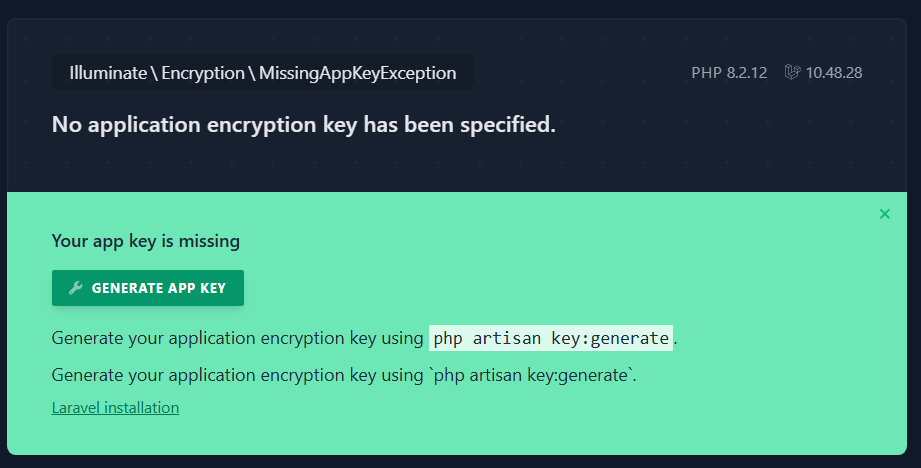
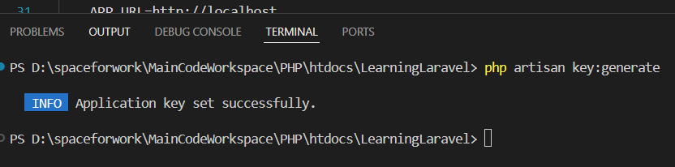

# Tạo application key
## APP_KEY
- Với Laravel, khi chạy chương trình, cần phải có một app_key. Nếu không có thì sẽ không chạy được

    ```
    APP_NAME=Laravel
    APP_ENV=local
    APP_KEY=
    APP_DEBUG=true
    APP_URL=http://localhost
    ```

- Kết quả khi ta bỏ app_key

    

- Để fix lỗi, ta nhấn generate app key hoặc gõ lệnh này trong terminal

    
