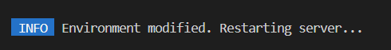
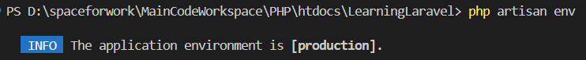
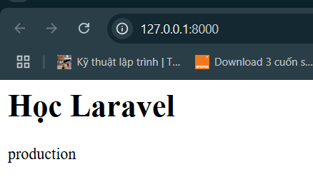
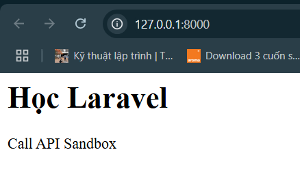
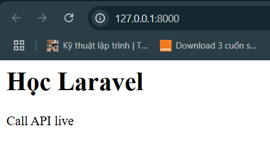
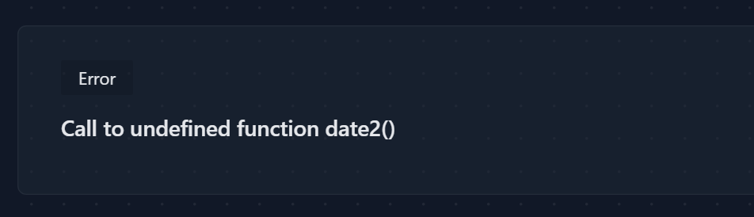
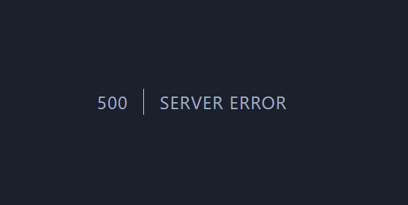

# Thiết lập môi trường
## APP_ENV
```
APP_NAME=Laravel
APP_ENV=local
APP_KEY=
APP_DEBUG=false
APP_URL=http://localhost
```

- Thử đổi thành `APP_ENV=production`
    - Không ảnh hưởng gì khi thay đổi

    - `APP_ENV=local` giống như tượng trưng cho môi trường chúng ta đang phát triển.

    - `APP_ENV=production` giống như phiên bản chúng ta đã hoàn thiện và chuẩn bị release cho khách hàng sử dụng

- `APP_ENV` giống như một `flag`. Trong quá trình code, chúng ta có thể dựa vào để có thể lựa chọn cách phù hợp.
    - VD:
        - Xây dựng chức năng thanh toán `Paypal`
            - `APP_ENV=local` => Gọi đến `API Sandbox` (Không cần dùng tiền thật cũng test được thanh toán)

            - `APP_ENV=production` => Call `Api live` (Dùng tiền thật để thanh toán)
        - Vậy thì khi ta phát triển, chỉ cần thay đổi `flag` chứ không cần phải thay đổi từng API trong code

- Khi đổi `flag`, server sẽ thông báo lỗi, yêu cầu ta khởi động lại server:

    

- Kiểm tra `APP_ENV` hiện tại là gì bằng câu lệnh:

    

- Sử dụng PHP để gọi `APP_ENV`
    - Sử dụng helper có sẵn `env()` trong Laravel

        - Tạo file `resources/views/env.blade.php` và copy code:
            ```php
            <h1>Học Laravel</h1>
            <?php

            echo env('APP_ENV');
            ```

        - Đăng ký route để hiển thị view
            - Copy đoạn code dán vào file `routes/web.php`:
                ```php
                Route::get('/', function () {
                    return view('env');
                });
                ```

        - Kết quả thu được:

            

    - Sử dụng helper `config()`
        - Vào file `config/app.php`, tìm key `env`

            ```php
            /*
            |--------------------------------------------------------------------------
            | Application Environment
            |--------------------------------------------------------------------------
            |
            | This value determines the "environment" your application is currently
            | running in. This may determine how you prefer to configure various
            | services the application utilizes. Set this in your ".env" file.
            |
            */

            'env' => env('APP_ENV', 'production'),
            ```

        - Thay đổi code file `resources/views/env.blade.php`
            - Cú pháp sẽ là: `config('file_name, key_name')`

                ```php
                <h1>Học Laravel</h1>
                <?php

                echo config('app.env');
                ```

- Ví dụ thực tế:
    - Khi phát triển, ta để cờ là `local` và gọi `API Sanbox`

    - Khi release, ta để ờ là `production` và gọi `API live`

    - Thay đổi code file `resources/views/env.blade.php`
        ```php
        <h1>Học Laravel</h1>
        <?php

        if (env('APP_ENV') == 'production') {
            // Call API live
            echo 'Call API live';
        } else {
            // Call API Sandbox
            echo 'Call API Sandbox';
        }
        ```

    - Test:
        - local
            ```
            APP_ENV=local
            ```
        
        - Kết quả thu được

            

        - Thay đổi thành production

            ```
            APP_ENV=production
            ```

        - Chạy lại server, kết quả thu được

            

## APP_DEBUG
- Giúp màn hình hiển thị chế độ debug

- Màn hình sẽ hiển thị lỗi gì khi chương trình error

    

- Kết quả khi ta chuyển thành false, màn hình chỉ hiển thị:

    ```
    APP_NAME=Laravel
    APP_ENV=local
    APP_KEY=
    APP_DEBUG=false
    APP_URL=http://localhost
    ```

    

- Chỉ nên để true trong môi trường phát triển.

- Khi deploy lên server thật, ta nên để false để tránh:
    - Bị lộ đường dẫn

    - Bị lộ thông tin lỗi

    - Không an toàn bảo mật

    - ...

- Khi để chế độ false, thông báo lỗi sẽ được thông báo trong file storage/logs/laravel.log
