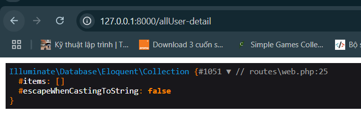

# Thiết lập cơ sở dữ liệu
- Tạo cơ sở dữ liệu
    - Tạo cơ sở dữ liệu `learnlaravel` trong `phpMyAdmin`

    

    - Phần database trong laravel sẽ sử dụng qua migration
        - Mặc định đã có các file sẵn tạo các bảng user

            

        - Ta thực hiện chạy migration để có thông tin table

            ```
            php artisan migrate
            ```
            - Kết quả:

            
        
            

        - Trước khi làm điều đó, ta phải thiết lập database:
            - Trong `.env`
                ```
                DB_CONNECTION=mysql
                DB_HOST=127.0.0.1
                DB_PORT=3306
                DB_DATABASE=learnlaravel
                DB_USERNAME=root
                DB_PASSWORD=mysql
                ```
            - Thay đổi các giá trị trong `config/database.php`
                ```php
                'mysql' => [
                    'driver' => 'mysql',
                    'url' => env('DATABASE_URL'),
                    'host' => env('DB_HOST', '127.0.0.1'),
                    'port' => env('DB_PORT', '3306'),
                    'database' => env('DB_DATABASE', 'forge'),
                    'username' => env('DB_USERNAME', 'forge'),
                    'password' => env('DB_PASSWORD', ''),
                    'unix_socket' => env('DB_SOCKET', ''),
                    'charset' => 'utf8mb4',
                    'collation' => 'utf8mb4_unicode_ci',
                    'prefix' => '',
                    'prefix_indexes' => true,
                    'strict' => true,
                    'engine' => null,
                    'options' => extension_loaded('pdo_mysql') ? array_filter([
                        PDO::MYSQL_ATTR_SSL_CA => env('MYSQL_ATTR_SSL_CA'),
                    ]) : [],
                ],
                ```

# Gọi lên cho người dùng
- Đăng ký route trả về, chứa dữ liệu
    - Sau khi migrate, có một Model User.php có sẵn
        - Truy cập vào file app/Models/User.php để xem

    - Đăng ký route trong file routes/web.php:
        - Ta cần use namespace Model

            ```php
            use App\Models\User;
            ```

        - Sử dụng helper dd() để xem rõ đối tượng

        - Sử dụng all() để xem toàn bộ các item

            ```php
            Route::get('/user-detail', function () {
                $user = new User();
                dd($user);
            });
            ```

            

            ```php
            Route::get('/allUser-detail', function () {
                $user = new User();
                $allUser = $user::all();
                dd($allUser);
            });
            ```

            

        - Chúng ta thử thay đổi cấu hình sai, DB_DATABASE thành một database không tồn tại

            ```
            DB_DATABASE=learnlaravel1
            ```

            - Kết quả báo lỗi:
                