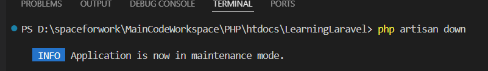
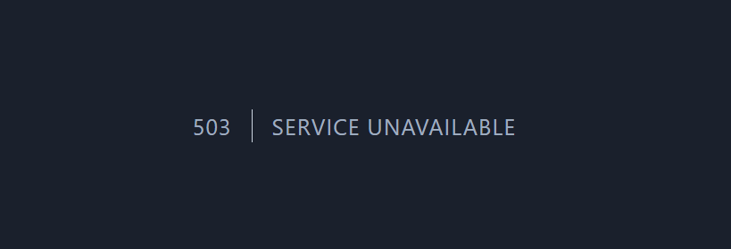
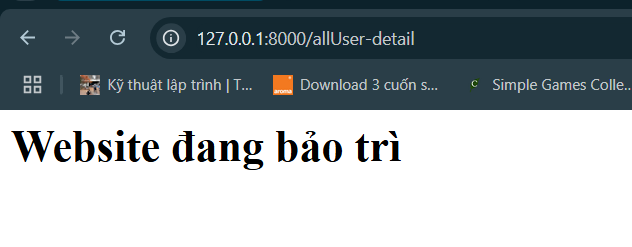

# Bật chế độ bảo trì
- Sử dụng câu lệnh

    

- Giả sử ta cần chỉnh sửa một vài thứ và không muốn ảnh hưởng đến người dùng, ta chạy câu lệnh để bảo trì
    - Kết quả thu được:
        

- Để chỉnh sửa, ta sẽ tạo file resources/views/errors/503.blade.php (Bắt buộc). Dán đoạn code này:

    ```php
    <h1>Website đang bảo trì</h1>
    ```

    - Kết quả thu được:

        

    - Ta có thể css thêm để đẹp hơn.