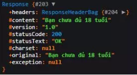

# Khởi tạo middleware
- Sử dụng lệnh artisan

```
php artisan make:middleware CheckAge
```

- Sau lệnh thực thi, file `CheckAge.php` được tạo trong thư mục `app/Http/Middleware`

- Nội dung file:
```php
<?php

namespace App\Http\Middleware;

use Closure;
use Illuminate\Http\Request;
use Symfony\Component\HttpFoundation\Response;

class CheckAge
{
    /**
     * Handle an incoming request.
     *
     * @param  \Closure(\Illuminate\Http\Request): (\Symfony\Component\HttpFoundation\Response)  $next
     */
    public function handle(Request $request, Closure $next): Response
    {
        return $next($request);
    }
}
```

- Method `handle()`
    - `$request`
        - Ta có thể lấy được các thuộc tính của request hiện tại:
            - Các giá trị tham số trong URI
            
            - Tên route
            
            - Phương thức HTTP
            
            - ...

    - `$next`
        - Có dạng là một Closure
        
        - Hiểu đơn giản nó dùng để cho phép request HTTP "qua cửa", tức là cho phép request HTTP đi tiếp để xử lý
        
        - Cú pháp: `$next($request)`.

# Ví dụ
- Tạo route:

```php
Route::get('age/{age}', function ($age) {
    return $age;
});
```

- Từ route trên, ta có thể hiểu:
    - Truyền giá trị cho tham số `age`:
        - Chương trình thực thi, in dữ liệu ra trình duyệt.

    - Giả sử:
        - `age ≥ 18`: in ra màn hình.

        - `age < 18`: in ra `"Chưa đủ 18 tuổi"`

    - Ta sẽ dùng middleware `CheckAge` để xử lý.

- Có thể thêm middleware cho một route bất kì với `middleware()` method
    - Tham số đầu vào là tên middleware class đó.

```php
Route::get('age/{age}', function ($age) {
    return $age;
})->middleware(CheckAge::class);
```

- Vào file `CheckAge` middeware để tiến hành code xử lý trong `handle()` method.
    - Cần lấy được giá trị của `age` trong middleware để kiểm tra `age ≥ 18 ?`

    - Các giá trị tham số URI sẽ được lấy thông qua `$request`

```php
public function handle($request, Closure $next)
{
    if ($request->age <= 18) {
        return response('Bạn chưa đủ 18 tuổi');
    }
    
    return $next($request)
}
```

# Đặt câu hỏi
- Tại sao dùng `return response('Bạn chưa đủ 18 tuổi');` (*)

- Tại sao không dùng `return 'Bạn chưa đủ 18 tuổi';` (**)

    - Nếu sử dụng (**), sẽ xuất hiện lỗi

    ```
    Error Exception: Trying to get property 'headers' of non-object
    ```

    - `var_dump(response('Bạn chưa đủ 18 tuổi'))` để kiểm tra

    

    - Nó trả về một object chứa thuộc tính `headers`, đó là lí do tại sao dùng (**) lại bị lỗi.

- Lưu ý:
    - Khi thực hiện một số công việc nào đó trong middleware
    
    - Sau khi kết thúc bạn phải return một object chứa thuộc tính headers.

# Một số action
- Một số action trả về object chứa thuộc tính `headers`
    - Cho phép HTTP request tiếp tục
        - `return $next($request)`

    - Trả về kết quả
        - `return response($data)`

    - Chuyển hướng đến một URI
        - `return redirect($URI)`

```php
public function handle($request, Closure $next)
{
    if ($condition) {
        // Some jobs
        // ...
        
        return redirect('home'); // http://localhost:8000/home
    }

    // Some jobs
    // ...
    
    return $next($request);
}
```

- Lưu ý:
    - Có thể type-hint bất kì service provider nào trong container trong phương thức __construct của middleware

    - Vì các service đã load trước khi middleware được gọi.

# Cách hoạt động của Middleware
- Nó được gọi ra trước khi request được gửi tới controller/action.

- Đôi khi trong thực tiễn, ta cần một chức năng gì đó mà request chạy trước middleware.

- Nghĩa là sau khi request đã được xử lý ở controller/action thì mới gọi middleware ra.

- Laravel đã cung cấp hai cách thức hoạt động đó là:
    - Before middleware

    - After middleware

## Before Middleware
```php
<?php

namespace App\Http\Middleware;

use Closure;

class BeforeMiddleware
{
    public function handle($request, Closure $next)
    {
        // Perform action

        return $next($request);
    }
}
```

## After Middleware
```php
<?php

namespace App\Http\Middleware;

use Closure;

class AfterMiddleware
{
    public function handle($request, Closure $next)
    {
        $response = $next($request);

        // Perform action

        return $response;
    }
}
```