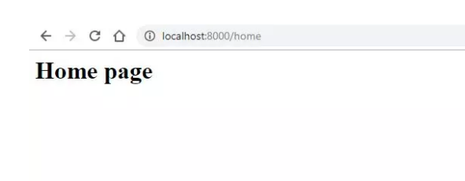

# Khởi tạo View
### Tạo view đơn giản
- Tạo một file view home.php với nội dung:

```php
<h1>Home page</h1>
```

- Để có thể xuất view này cho client, có thể khai báo route như sau:

- Sử dụng global helper function view để có thể trả về một view nào đó với tham số là tên của view (không lấy đuôi mở rộng).
```php
Route::get('/home', function () {
    return view('home');
});
```

- Truy cập đường dẫn [/home](http://127.0.0.1:8000/home)



### Phân chia cấp cho view
- View trong Laravel có thể phân chia cấp thư mục để dễ dàng quản lý.

- Ví dụ:
    - Ứng dụng có `client-side` và `admin-side`
    
    - Các view của `admin-side` sẽ nằm ở trong một thư mục `resources/views/admin`.

- Đầu tiên tạo thư mục `admin` trong `resources/views`

- Tiếp theo mình sẽ tạo một file `setting.php`

- Đặt nó nằm trong `resources/views/admin`.

```
resources/
├── views/
|   ├── admin/
|   |   |   setting.php 
|   |   home.php
```

- Đăng ký route:

```php
Route::get('/admin/setting', function() {
    return view('admin.setting');
});
```

- Tham số truyền vào có chút đặc biệt, đó là có thêm dấu `.`
    - Với dấu `.` này, Laravel sẽ hiểu là chúng ta đang đi vào sub-directory `admin/setting`.