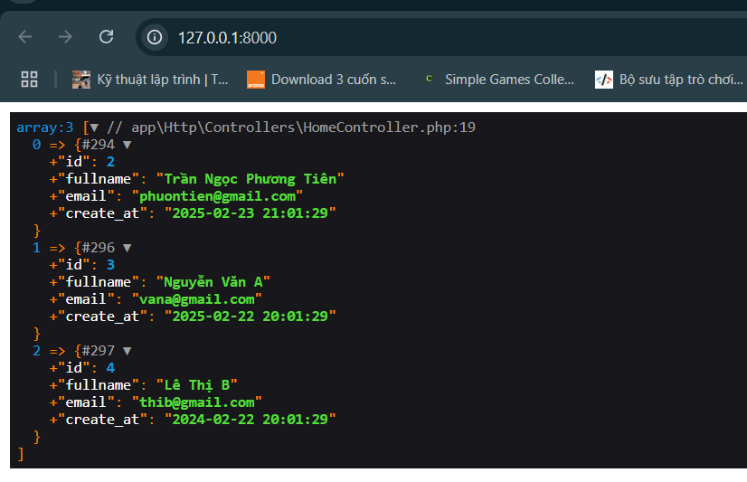

<style>
    img {
        max-width: 600px;
    }
</style>

# Ví dụ về thức select()
## Bước 1
- Tạo view `resources/views/clients/home.blade.php`, copy đoạn mã sau vào:
    ```php
    <div>
        <h2><?php echo $title ?></h2>
        <h3><?php echo $message ?></h3>
    </div>
    ```

- Tạo basic controller HomeController

    

    ```php
    <?php

    namespace App\Http\Controllers;

    use Illuminate\Http\Request;

    class HomeController extends Controller
    {
        //
    }
    ```

- Thêm đoạn code sau đây vào file `app/Http/controllers/HomeController.php`
    ```php
    <?php

    namespace App\Http\Controllers;

    use Illuminate\Http\Request;

    class HomeController extends Controller
    {
        public $data = [];
        public function index() {
            $this->data['title'] = 'Đào tạo lập trình web';

            $this->data['message'] = 'Đăng ký tài khoản thành công';

            return view('clients.home', $this->data);
        }
    }
    ```

- Đăng ký route tại `routes/web.php`
    ```php
    <?php

    use Illuminate\Support\Facades\Route;
    use namespace App\Http\Controllers\HomeController;

    /*
    |--------------------------------------------------------------------------
    | Web Routes
    |--------------------------------------------------------------------------
    |
    | Here is where you can register web routes for your application. These
    | routes are loaded by the RouteServiceProvider and all of them will
    | be assigned to the "web" middleware group. Make something great!
    |
    */

    Route::get('home', [HomeController::class, 'index']);
    ```

- Kết quả thu được:

    

## Bước 2:
- Thêm namespace DB cho controller `app/Http/Controllers/HomeController.php` để sử dụng lớp
    ```php
    use Illuminate\Support\Facades\DB;
    ```

    - hoặc

    ```php
    use DB;
    ```

- Tạo bảng trong phpMyAdmin:

    

    

- Insert dữ liệu thủ công

    

- Test phương thức `select()` với 1 tham số
    - Dán code này vào file app/Http/Controllers/HomeController.php
        ```php
        <?php

        namespace App\Http\Controllers;

        use Illuminate\Http\Request;

        use Illuminate\Support\Facades\DB;

        class HomeController extends Controller
        {
            public $data = [];
            public function index() {
                $this->data['title'] = 'Đào tạo lập trình web';

                $this->data['message'] = 'Đăng ký tài khoản thành công';

                $user = DB::select('select * from user');

                dd($user);

                // return view('clients.home', $this->data);
            }
        }
        ```

    - Kết quả thu được:

        

    - Nhận xét: trả về một mảng, mỗi phần tử trong mảng là một đối tượng. Nên ta không thể gọi dữ liệu theo cách thông thường là ngoặc vuông của mảng. Ta phải sử dụng cách gọi của object.


    - Insert thêm 3 dữ liệu nữa:

        

    - Tải lại trang, kết quả thu được:

        

- Test phương thức `select()` với 1 tham số (chuỗi truy vấn) và có điều kiện
    - Thay đổi đoạn code:
        ```php
        $user = DB::select('SELECT * FROM user WHERE id > 1');
        ```

    - Kết quả thu được

        

- Test phương thức `select()` với 2 tham số (chuỗi truy vấn và tham số truyền vào chuỗi đó) và có điều kiện
    - Thay đổi đoạn code:
        ```php
        $user = DB::select('SELECT * FROM user WHERE id > ?', [2]);
        ```

    - Kết quả thu được

        

    - Nhận xét:
        - Cách truyền dữ liệu trên khác giống truyền PDO. Laravel cũng dùng PDO

- Truyền tham số cho chuỗi truy vấn dưới dạng có key
    - Thay đổi đoạn code:
        ```php
        $user = DB::select('SELECT * FROM user WHERE email=:mail',[
            'mail' => 'hoaiphu.web@gmail.com',
        ]);
        ```

    - Kết quả thu được:
        
        