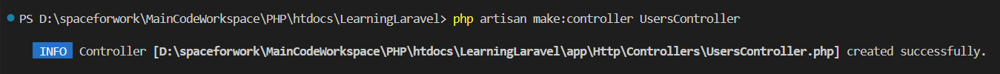
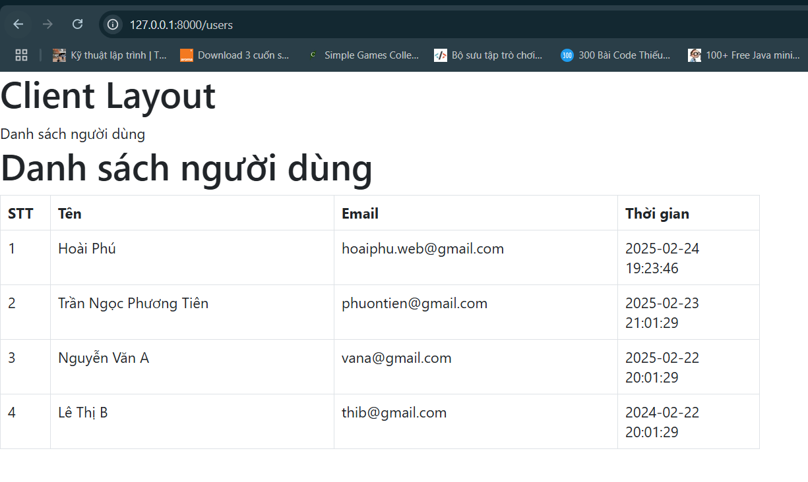

<style>
    img {
        max-width: 600px;
    }
</style>

# Ví dụ về đọc dữ liệu
## Bước 1
- Tạo view: `resources/views/layouts/client.blade.php`, copy đoạn code
    ```php
    <h1>Client Layout</h1>

    @yield('title')

    @yield('content')
    ```

- Tạo view: `resources/views/clients/users/list.blade.php`, copy đoạn code
    ```php
    @extends('layouts.client')
    @section('title')
        {{$title}}
    @endsection

    @section('content')
        @if (session('msg'))
        <div class="alert alert-success">{{session('msg')}}</div>
        @endif

        <h1>{{$title}}</h1>

        Content
    @endsection
    ```

- Tạo file Controller: `app/Http/controllers/UsersController.php`, copy đoạn code
    
    

    ```php
    <?php

    namespace App\Http\Controllers;

    use Illuminate\Http\Request;

    use DB;

    class UsersController extends Controller
    {
        public function index() {
            $title = 'Danh sách người dùng';
            return view('clients.users.list', compact('title'));
        }
    }
    ```

- Đăng ký route:
    ```php
    <?php

    use Illuminate\Support\Facades\Route;
    use App\Http\Controllers\UsersController;

    /*
    |--------------------------------------------------------------------------
    | Web Routes
    |--------------------------------------------------------------------------
    |
    | Here is where you can register web routes for your application. These
    | routes are loaded by the RouteServiceProvider and all of them will
    | be assigned to the "web" middleware group. Make something great!
    |
    */

    Route::prefix('users')->group(function() {
        Route::get('', [UsersController::class, 'index']);
    });
    ```

- Gán bootstrap trong file `resources/views/clients/users/list.blade.php` và thay đổi nội dung content:
    ```php
    <head>
        <link href="https://cdn.jsdelivr.net/npm/bootstrap@5.3.0/dist/css/bootstrap.min.css" rel="stylesheet">
    </head>

    @extends('layouts.client')
    @section('title')
        {{$title}}
    @endsection

    @section('content')
        @if (session('msg'))
        <div class="alert alert-success">{{session('msg')}}</div>
        @endif

        <h1>{{$title}}</h1>

        <table class="table table-bordered">
            <thead>
                <tr>
                    <th width="5%">STT</th>
                    <th>Tên</th>
                    <th>Email</th>
                    <th width="15%">Thời gian</th>
                </tr>
            </thead>

            <tbody>
                <tr>
                    <td>1</td>
                    <td>2</td>
                    <td>3</td>
                    <td>4</td>
                </tr>
            </tbody>
        </table>
    @endsection
    ```

- Đổ dữ liệu vào
    - Mở file `app/Http/controllers/UsersController.php`, dán code
        ```php
        <?php

        namespace App\Http\Controllers;

        use Illuminate\Http\Request;

        use DB;

        class UsersController extends Controller
        {
            public function index() {
                $title = 'Danh sách người dùng';

                $user = DB::select('SELECT * FROM user ORDER BY create_at DESC');
                
                return view('clients.users.list', compact('title', 'user'));
            }
        }
        ```

    - Sửa code file `resources/views/clients/users/list.blade.php`, dán code:
        ```php
        <head>
            <link href="https://cdn.jsdelivr.net/npm/bootstrap@5.3.0/dist/css/bootstrap.min.css" rel="stylesheet">
        </head>

        @extends('layouts.client')
        @section('title')
            {{$title}}
        @endsection

        @section('content')
            @if (session('msg'))
            <div class="alert alert-success">{{session('msg')}}</div>
            @endif

            <h1>{{$title}}</h1>

            <table style="width: 60%;" class="table table-bordered">
                <thead>
                    <tr>
                        <th width="5%">STT</th>
                        <th width="30%">Tên</th>
                        <th width="30%">Email</th>
                        <th width="15%">Thời gian</th>
                    </tr>
                </thead>

                <tbody>
                    @if (!empty($user))
                        @foreach ($user as $key => $item)
                            <tr>
                                <td>{{$key + 1}}</td>
                                <td>{{$item->fullname}}</td>
                                <td>{{$item->email}}</td>
                                <td>{{$item->create_at}}</td>
                            </tr>
                        @endforeach
                    @else
                        <tr>
                            <td colspan="4">Không có người dùng</td>
                        </tr>
                    @endif
                </tbody>
            </table>
        @endsection
        ```

- Kết quả thu được:

    