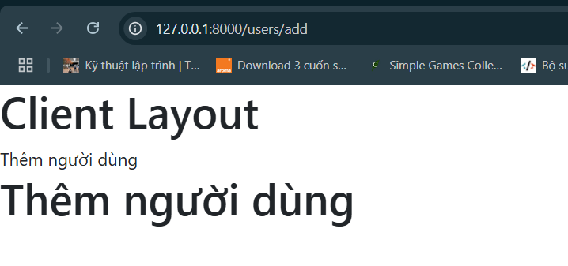

<style>
    img {
        width: 600px;
    }
</style>

# Ví dụ về phương thức Insert
- Ở phần trước, có một vấn đề là ta đã thực hiện truy vấn ở trong Controller. Điều này thật sự không đúng lắm.

- Ta cần thực hiện việc này ở phần Model

- Vì mặc định Laravel tạo ra một Model User. Nên ta sẽ tạo ra một Model khác: Users

## Bước 1: Chuẩn bị, thay đổi sang xử lý bằng Model
- Chạy câu lệnh tạo model: tạo file `app/Models/Users.php`

    
    
    ```php
    <?php

    namespace App\Models;

    use Illuminate\Database\Eloquent\Factories\HasFactory;
    use Illuminate\Database\Eloquent\Model;

    class Users extends Model
    {
        use HasFactory;
    }
    ```

- Xử lý truy vấn bên trong Model

    ```php
    <?php

    namespace App\Models;

    use Illuminate\Database\Eloquent\Factories\HasFactory;
    use Illuminate\Database\Eloquent\Model;

    use DB;

    class Users extends Model
    {
        use HasFactory;

        public function getAllUser() {
            $users = DB::select('SELECT * FROM user ORDER BY create_at DESC');

            return $users;
        }
    }
    ```

- Tạo view: ta sẽ tạo 2 view giống với phần `5_read_data` lần lượt là:
    - `resources/views/clients/users/list.blade.php`

    - Lưu ý: tên biến được truyền vào phải trùng với bên Controlelr ($usersList)

        ```php
        <head>
            <link href="https://cdn.jsdelivr.net/npm/bootstrap@5.3.0/dist/css/bootstrap.min.css" rel="stylesheet">
        </head>

        @extends('layouts.client')
        @section('title')
            {{$title}}
        @endsection

        @section('content')
            @if (session('msg'))
            <div class="alert alert-success">{{session('msg')}}</div>
            @endif

            <h1>{{$title}}</h1>

            <table style="width: 60%;" class="table table-bordered">
                <thead>
                    <tr>
                        <th width="5%">STT</th>
                        <th width="30%">Tên</th>
                        <th width="30%">Email</th>
                        <th width="15%">Thời gian</th>
                    </tr>
                </thead>

                <tbody>
                    @if (!empty($usersList))
                        @foreach ($usersList as $key => $item)
                            <tr>
                                <td>{{$key + 1}}</td>
                                <td>{{$item->fullname}}</td>
                                <td>{{$item->email}}</td>
                                <td>{{$item->create_at}}</td>
                            </tr>
                        @endforeach
                    @else
                        <tr>
                            <td colspan="4">Không có người dùng</td>
                        </tr>
                    @endif
                </tbody>
            </table>
        @endsection
        ```

    - `resources/views/layouts/client.blade.php`
        ```php
        <h1>Client Layout</h1>

        @yield('title')

        @yield('content')
        ```

- Tạo controller: `app/Http/Controllers/UsersController.php`

    

- Gọi Model ra Controller: ta phải use namespace trước

    ```php
    <?php

    namespace App\Http\Controllers;

    use Illuminate\Http\Request;

    use App\Models\Users;

    class UsersController extends Controller
    {
        public function index() {
            $title = 'Danh sách người dùng';

            $users = new Users();

            $usersList = $users->getAllUsers();

            return view('clients.users.list', compact('title', 'usersList'));
        }
    }
    ```

- Đăng ký Route cho controller trên:
    ```php
    Route::get('users', [App\Http\Controllers\UsersController::class, 'index']);
    ```

- Kết quả thu được:

    

- Nhận xét:
    - Xử lý truy vấn như phần trước (ở Controller) vẫn đúng

    - Nhưng nó không đúng với logic mô hình MVC
    
    - Làm khó khăn trong việc bảo trì.

## Bước 2: Làm chức năng insert
- Chỉnh sửa file `resources/views/clients/users/list.blade.php`, copy code:
    ```php
    <head>
        <link href="https://cdn.jsdelivr.net/npm/bootstrap@5.3.0/dist/css/bootstrap.min.css" rel="stylesheet">
    </head>

    @extends('layouts.client')
    @section('title')
        {{$title}}
    @endsection

    @section('content')
        @if (session('msg'))
        <div class="alert alert-success">{{session('msg')}}</div>
        @endif

        <h1>{{$title}}</h1>

        <a href="#" class="btn btn-primary">Thêm người dùng</a>

        <hr>

        <table style="width: 60%;" class="table table-bordered">
            <thead>
                <tr>
                    <th width="5%">STT</th>
                    <th width="30%">Tên</th>
                    <th width="30%">Email</th>
                    <th width="15%">Thời gian</th>
                </tr>
            </thead>

            <tbody>
                @if (!empty($usersList))
                    @foreach ($usersList as $key => $item)
                        <tr>
                            <td>{{$key + 1}}</td>
                            <td>{{$item->fullname}}</td>
                            <td>{{$item->email}}</td>
                            <td>{{$item->create_at}}</td>
                        </tr>
                    @endforeach
                @else
                    <tr>
                        <td colspan="4">Không có người dùng</td>
                    </tr>
                @endif
            </tbody>
        </table>
    @endsection
    ```

- Kết quả:

    

- Thực hiện việc: nhận nút `Thêm người dùng` thì sẽ xuất hiện trang thêm

- Tạo view: `resources/views/clients/users/add.blade.php`
    ```php
    <head>
        <link href="https://cdn.jsdelivr.net/npm/bootstrap@5.3.0/dist/css/bootstrap.min.css" rel="stylesheet">
    </head>

    @extends('layouts.client')
    @section('title')
        {{$title}}
    @endsection

    @section('content')
        @if (session('msg'))
        <div class="alert alert-success">{{session('msg')}}</div>
        @endif

        <h1>{{$title}}</h1>
    @endsection
    ```

- Trong `app/Http/Controllers/UsersController.php`
    - Thêm hàm construct để khởi tạo user, dễ dàng thao tác với Model Users hơn.

    - Thêm action add() trong `app/Http/Controllers/UsersController.php` trả về view `add.blade.php`

        ```php
        <?php

        namespace App\Http\Controllers;

        use Illuminate\Http\Request;

        use App\Models\Users;

        class UsersController extends Controller
        {
            private $user;
            
            public function __construct() {
                $this->users = new Users();
            }
            
            public function index() {
                $title = 'Danh sách người dùng';

                $usersList = $this->users->getAllUsers();

                return view('clients.users.list', compact('title', 'usersList'));
            }

            public function add() {
                $title = 'Thêm người dùng';

                return view('clients.users.add', compact('title'));
            }
        }
        ```

- Đăng ký lại route cho action mới:
    ```php
    <?php

    use Illuminate\Support\Facades\Route;
    use App\Models\User;

    /*
    |--------------------------------------------------------------------------
    | Web Routes
    |--------------------------------------------------------------------------
    |
    | Here is where you can register web routes for your application. These
    | routes are loaded by the RouteServiceProvider and all of them will
    | be assigned to the "web" middleware group. Make something great!
    |
    */

    Route::prefix('users')->group(function() {
        Route::get('', [App\Http\Controllers\UsersController::class, 'index']);

        Route::get('add', [App\Http\Controllers\UsersController::class, 'add']);
    });
    ```

- Kết quả thu được:

    

- Chỉnh sửa: thêm form cho `resources/views/clients/users/add.blade.php`

    ```php
    <head>
        <link href="https://cdn.jsdelivr.net/npm/bootstrap@5.3.0/dist/css/bootstrap.min.css" rel="stylesheet">
    </head>

    @extends('layouts.client')
    @section('title')
        {{$title}}
    @endsection

    @section('content')
        @if (session('msg'))
        <div class="alert alert-success">{{session('msg')}}</div>
        @endif

        <h1>{{$title}}</h1>

        <form action="" method="POST">
            <div class="mb-3">
                <label for="">Họ và tên:</label>
                <input type="text" style="width: 40%;" class="form-control" name="fullname" placeholder="Họ và tên ....">
            </div>

            <div class="mb-3">
                <label for="">Email: </label>
                <input type="text" style="width: 40%;" class="form-control" name="email" placeholder="Email ....">
            </div>

            <button type="submit" class="btn btn-primary">Thêm mới</button>

            <a href="#" class="btn btn-warning">Quay lại</a>
            @csrf
        </form>
    @endsection
    ```

- Kết quả thu được:

    

- Thêm action xử lý phương thức Post trong Controller `app/Http/Controllers/UsersController.php`
    ```php
    <?php

    namespace App\Http\Controllers;

    use Illuminate\Http\Request;

    use App\Models\Users;

    class UsersController extends Controller
    {
        private $user;
        
        public function __construct() {
            $this->users = new Users();
        }
        
        public function index() {
            $title = 'Danh sách người dùng';

            $usersList = $this->users->getAllUsers();

            return view('clients.users.list', compact('title', 'usersList'));
        }

        public function add() {
            $title = 'Thêm người dùng';

            return view('clients.users.add', compact('title'));
        }

        public function postAdd(Request $request) {
            return 'ok';
        }
    }
    ```

- Đăng ký route cho action postAdd() này:
    ```php
    <?php

    use Illuminate\Support\Facades\Route;
    use App\Models\User;

    /*
    |--------------------------------------------------------------------------
    | Web Routes
    |--------------------------------------------------------------------------
    |
    | Here is where you can register web routes for your application. These
    | routes are loaded by the RouteServiceProvider and all of them will
    | be assigned to the "web" middleware group. Make something great!
    |
    */

    Route::prefix('users')->group(function() {
        Route::get('', [App\Http\Controllers\UsersController::class, 'index']);

        Route::get('add', [App\Http\Controllers\UsersController::class, 'add']);

        Route::post('add', [App\Http\Controllers\UsersController::class, 'postAdd']);
    });
    ```

- Đặt tên cho route: group và các route con trong `routes/web.php`
    ```php
    <?php

    use Illuminate\Support\Facades\Route;
    use App\Models\User;

    /*
    |--------------------------------------------------------------------------
    | Web Routes
    |--------------------------------------------------------------------------
    |
    | Here is where you can register web routes for your application. These
    | routes are loaded by the RouteServiceProvider and all of them will
    | be assigned to the "web" middleware group. Make something great!
    |
    */

    Route::prefix('users')->name('users.')->group(function() {
        Route::get('', [App\Http\Controllers\UsersController::class, 'index'])->name('index');

        Route::get('add', [App\Http\Controllers\UsersController::class, 'add'])->name('add');

        Route::post('add', [App\Http\Controllers\UsersController::class, 'postAdd'])->name('post-add');
    });
    ```

- Tiến hành gắn link cho nút `Thêm người dùng`, ta vào trong `resources/views/clients/users/list.blade.php`, chỉnh sửa code:

    ```php
    <a href="{{route('users.add')}}" class="btn btn-primary">Thêm người dùng</a>
    ```

- Tiến hành gắn link cho nút `Quay lại`, ta vào trong `resources/views/clients/users/add.blade.php`, chỉnh sửa code:

    ```php
    <a href="{{route('users.index')}}" class="btn btn-warning">Quay lại</a>
    ```

- Trong quá trình thêm, ta cần xử lý validate, chỉnh sửa action postAdd() trong file `app/Http/Controllers/UsersController.php`.
    ```php
    <?php

    namespace App\Http\Controllers;

    use Illuminate\Http\Request;

    use App\Models\Users;

    class UsersController extends Controller
    {
        private $user;
        
        public function __construct() {
            $this->users = new Users();
        }
        
        public function index() {
            $title = 'Danh sách người dùng';

            $usersList = $this->users->getAllUsers();

            return view('clients.users.list', compact('title', 'usersList'));
        }

        public function add() {
            $title = 'Thêm người dùng';

            return view('clients.users.add', compact('title'));
        }

        public function postAdd(Request $request) {
            $request->validate([
                'fullname' => 'required|min:5',
                'email' => 'required|email',
            ], [
                'fullname.required' => 'Họ và tên bắt buộc phải nhập',
                'fullname.min' => 'Họ và tên phải từ :min ký tự trở lên',
                'email.required' => 'Email bắt buộc',
                'email.email' => 'Email không đúng định dạng',
            ]);

            return 'ok';
        }
    }
    ```

- Xử lý khi nhập lỗi (Không vượt qua validate). Tiến hành chỉnh sửa file `resources/views/clients/users/add.blade.php`

    ```php
    <head>
        <link href="https://cdn.jsdelivr.net/npm/bootstrap@5.3.0/dist/css/bootstrap.min.css" rel="stylesheet">
    </head>

    @extends('layouts.client')
    @section('title')
        {{$title}}
    @endsection

    @section('content')
        @if (session('msg'))
        <div class="alert alert-success">{{session('msg')}}</div>
        @endif

        @if ($errors->any())
        <div class="alert alert-danger">Dữ liệu nhập vào không hợp lệ, vui lòng kiểm tra lại !</div>
        @endif

        <h1>{{$title}}</h1>

        <form action="" method="POST">
            <div class="mb-3">
                <label for="">Họ và tên:</label>
                <input type="text" style="width: 40%;"
                class="form-control" name="fullname"
                placeholder="Họ và tên ...." value={{old('fullname')}}>
                @error('fullname')
                    <span style="color: red;">{{$message}}</span>
                @enderror
            </div>

            <div class="mb-3">
                <label for="">Email: </label>
                <input type="text" style="width: 40%;"
                class="form-control" name="email"
                placeholder="Email ...." value={{old('email')}}>
                @error('email')
                    <span style="color: red;">{{$message}}</span>
                @enderror
            </div>

            <button type="submit" class="btn btn-primary">Thêm mới</button>

            <a href="{{route('users.index')}}" class="btn btn-warning">Quay lại</a>
            @csrf
        </form>
    @endsection
    ```

- Kết quả thu được:
    - Khi nhập sai:
        
        

    - Khi nhập đúng:

        

- Hiện tại, trường hợp đúng vẫn in ra ok. Ta sẽ xử lý trường hợp này.

- Mở `app/Models/Users.php`. Thêm phần xử lý addUser(). Chỉnh sửa code:

    ```php
    <?php

    namespace App\Models;

    use Illuminate\Database\Eloquent\Factories\HasFactory;
    use Illuminate\Database\Eloquent\Model;

    use DB;

    class Users extends Model
    {
        use HasFactory;

        private $table = 'user';

        public function getAllUsers() {
            $users = DB::select('SELECT * FROM user ORDER BY create_at DESC');

            return $users;
        }

        public function addUser($data) {
            DB::insert('INSERT INTO user (name, email, create_at) VALUES (?, ?, ?)', $data);
        }
    }
    ```
- Tiến hành gọi ở action postAdd() ở controller `app/Http/Controllers/UsersController.php`
    ```php
    <?php

    namespace App\Http\Controllers;

    use Illuminate\Http\Request;

    use App\Models\Users;

    class UsersController extends Controller
    {
        private $users;
        
        public function __construct() {
            $this->users = new Users();
        }
        
        public function index() {
            $title = 'Danh sách người dùng';

            $usersList = $this->users->getAllUsers();

            return view('clients.users.list', compact('title', 'usersList'));
        }

        public function add() {
            $title = 'Thêm người dùng';

            return view('clients.users.add', compact('title'));
        }

        public function postAdd(Request $request) {
            $request->validate([
                'fullname' => 'required|min:5',
                'email' => 'required|email',
            ], [
                'fullname.required' => 'Họ và tên bắt buộc phải nhập',
                'fullname.min' => 'Họ và tên phải từ :min ký tự trở lên',
                'email.required' => 'Email bắt buộc',
                'email.email' => 'Email không đúng định dạng',
            ]);

            $dataInsert = [
                $request->fullname,
                $request->email,
                date('Y-m-d H:i:s'),
            ];
            
            $this->users->addUser($dataInsert);

            return redirect()->route('users.index')->with('msg', 'Thêm người dùng thành công');
        }
    }
    ```

- Kết quả thu được khi nhập đúng:

    

- Ta cũng có thể làm bằng `$request->all()`. Nhưng nếu như vậy, ta phải chuyển về dạng tuần tự nên nó sẽ lâu hơn

- Ta muốn thực hiện validate() check xem email đó có tồn tại không. Chỉnh sửa action postAdd()
    - Ta có thể lên document laravel để tìm kiếm rule cho chuẩn

    - https://laravel.com/docs/10.x/validation#quick-writing-the-validation-logic
    
    ```php
    public function postAdd(Request $request) {
        $request->validate([
            'fullname' => 'required|min:5',
            'email' => 'required|email|unique:user',
        ], [
            'fullname.required' => 'Họ và tên bắt buộc phải nhập',
            'fullname.min' => 'Họ và tên phải từ :min ký tự trở lên',
            'email.required' => 'Email bắt buộc',
            'email.email' => 'Email không đúng định dạng',
            'email.unique' => 'Email đã tồn tại'
        ]);

        $dataInsert = [
            $request->fullname,
            $request->email,
            date('Y-m-d H:i:s'),
        ];
        
        $this->users->addUser($dataInsert);

        return redirect()->route('users.index')->with('msg', 'Thêm người dùng thành công');
    }
    ```

- Kết quả thu được khi nhập email đã tồn tại trong hệ thống:

    
